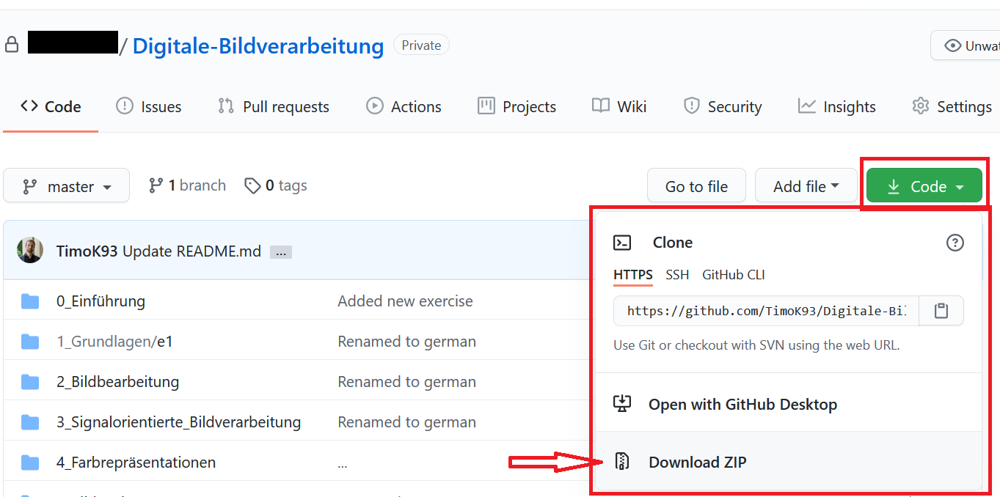
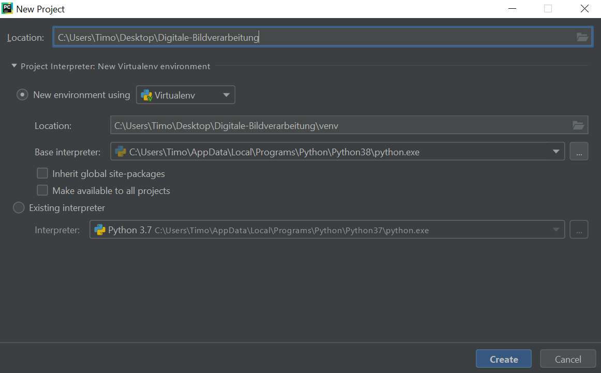
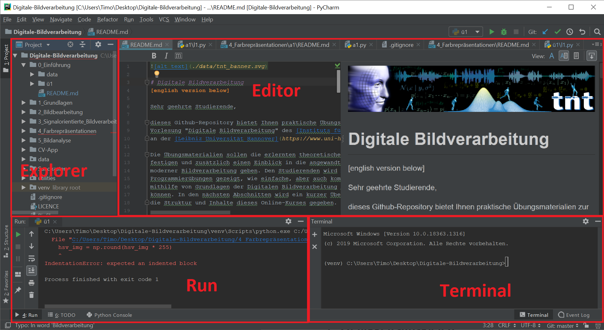
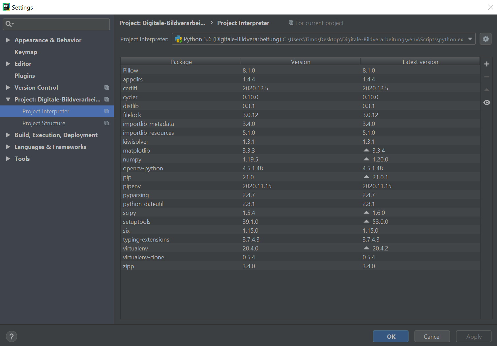

# Einführung
In diesem Kapitel werden Sie mit den nötigen Werkzeugen ausgestattet, um diesen Kurs zu meistern.
Dafür wird ihnen gezeigt, wie Sie die dieses Repository korrekt auf Ihren Rechner installieren. 
Sie werden grundlegend in die Programmiersprache Python und die Programmierumgebung PyCharm eingeführt. Arbeiten Sie die
folgenden Abschnitte in der gegebenen Reihenfolge durch.

**Hinweis:** Sollten Sie bereits Erfahrung mit Github, Python und Pycharm haben, können Sie dieses Einführung überspringen.

## Installation Python
Installieren Sie den Python-Interpreter in der Version 3.5 oder höher. Die Installation ist Abhängig von Ihrem Betriebssystem.

Für das Betriebssystem
 - **Windows** finden Sie Python zum Download auf [https://www.python.org/downloads/windows/](https://www.python.org/downloads/windows/)
 - **Mac OS** finden Sie Python zum Download auf [https://www.python.org/downloads/mac-osx/](https://www.python.org/downloads/mac-osx/)
 - **Linux** ist Python auf den meisten Distributionen vorinstalliert

Eine detailliertes Tutorial zu Python finden Sie unter [https://wiki.python.org/moin/BeginnersGuide](https://wiki.python.org/moin/BeginnersGuide).

## Installation PyCharm Community Edition
Die Programmierumgebung PyCharm ist eine für private- und Lehrzwecke frei verfügbare Software, welche die Arbeit mit
Python sehr stark vereinfacht. Die Verwendung von PyCharm ist für diesen Kurs nicht notwendig aber dringend empfohlen!

Die Installation geschieht auf jedem Betriebssystem mithilfe einer Installationsdatei, welche für
 - **Windows** unter [https://www.jetbrains.com/de-de/pycharm/download/#section=windows](https://www.jetbrains.com/de-de/pycharm/download/#section=windows)
 - **Mac OS** unter [https://www.jetbrains.com/de-de/pycharm/download/#section=mac](https://www.jetbrains.com/de-de/pycharm/download/#section=mac)
 - **Linux** unter [https://www.jetbrains.com/de-de/pycharm/download/#section=linux](https://www.jetbrains.com/de-de/pycharm/download/#section=linux)
 
erhältlich ist.

**Hinweis:** Sollten Sie Interesse an zusätzlichen Funktionen haben, können Sie als Student eine zeitlich limitierte 
kostenlose *PyCharm-Professional*  Lizenz für Lehrzwecke erwerben. Weitere Informationen finden Sie unter
[https://www.jetbrains.com/de-de/community/education/#students](https://www.jetbrains.com/de-de/community/education/#students).

## Download der Daten
Wenn Sie diesen Text lesen, werden Sie das Github Repository vermutlich bereits gefunden haben. Der Kurs wird auf der Platform
Github gehosted, um die Aufgaben kontinuierlich weiterentwickeln zu können und Ihnen dabei stets Zugriff auf den
neusten Entwicklungsstand zu geben. Weiterhin bietet Github die Möglichkeit, dass Sie aktiv bei der Mitgestaltung dieses
Kurses beitragen können.

Der Download der Daten kann entweder über **Git** oder die einfache **Download-Funktion** geschehen. Es wird die
Methode Git empfohlen. Weitere Informationen zu Git finden Sie unter 
[https://guides.github.com/introduction/git-handbook/](https://guides.github.com/introduction/git-handbook/).

Sollten Sie sich gegen Git und für die Download-Funktion entscheiden, können Sie den Download wie im folgenden Bild 
gezeigt starten.



Downloaden und speichern Sie die Daten an einem beliebigen Pfad, z.B. `C:\Users\Timo\Desktop\Digitale-Bildverarbeitung`.
Im folgenden wird der von Ihnen ausgesuchte Pfad als `WORKING_DIRECTORY` beschrieben. Sollten Sie die Daten erfolgreich
gespeichert haben, sollte diese README-Datei an der Stelle `WORKING_DIRECTORY\0_Einführung\README.md` liegen.  

**Hinweis:** Sie sind herzlich dazu eingeladen Git *Merge Requests* zu verwenden, um eventuelle Fehler zu korrigieren oder 
neue Aufgaben zu erstellen.

## Einrichtung einer Virtuellen Umgebung
Starten Sie PyCharm und erstellen Sie ein neues Projekt. Es wird ein Dialog geöffnet, welcher ähnlich der folgenden 
Abbildung aussieht. 


Wählen Sie ihr `WORKIND_DIRECTORY` in dem Feld *Location* aus und wählen Sie als Projekt Interpreter
*New environment using* und *Virtualenv* aus. Die Initialisierung kann einen Moment dauern! 

Nachdem die Umgebung erfolgreich erstellt wurde, sollten Sie das Programm PyCharm in etwa wie in der nächsten Abbildung
dargstellt sehen.

Die rot markierten Felder **Explorer**, **Editor**, **Run** und **Terminal** sind für Ihre Arbeit von besonderem Interesse.
Dabei ist
 - **Explorer** eine Projektübersicht, um zwischen den Dateien des Projektes zu wechseln
 - **Editor** ein Fenster, um Dateien zu bearbeiten
 - **Run** das Ausgabefenster eines Python Programms
 - **Terminal** eine interne Kommandozeile
 


Wenn Sie den Reiter `File/Settings/Project: Digitale-Bildverarbeitung/Project Interpreter` (variiert leicht bei den Betriebssystemen!)
öffnen, sollte die Ausgabe ähnlich zu der folgenden Abbildung sein. Die Anzahl der Packages kann dabei deutlich geringer sein. 


Wechseln Sie nun in das Terminal und verwenden foldende Befehle:

```bash
python -m pip install --upgrade pip
python -m pip install pipenv
pipenv install --skip-lock
```
Die Ausfürhung kann einen Moment dauern! Verwenden Sie folgenden Befehl um die korrekte Installation zu testen:

```bash
python 0_Einführung/test_installation.py
```

Herzlichen Glückwunsch, Sie haben den Kurs erfolgreich eingerichtet!