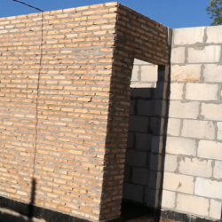

# Übung 4: Aliasing

In dieser Übung wird das *Aliasing* betrachtet. Der Effekt des *Aliasing* entsteht,
wenn eine Struktur mit einer zu geringen Rate abgetastet wird. Als Beispiel wird das Bild

verwendet. Programmieren Sie ein Skript, mit dem das Bild eingelesen und mit den Faktoren 2, 4 und 10 skaliert wird.
Zeigen Sie sich die Bilder an. Verwenden Sie während der Skalierung die Nearest-Neighbour Interpolation! 

Schreiben Sie Ihr Skript in die Datei [a.py](a.py). Die Lösung ist in der Datei [l_a.py](l_a.py) zu finden!

Was fällt Ihnen bei der Betrachtung der Bilder auf?

## Technische Beschreibung des Phänomens

Das Aliasing entsteht durch die Unterabtastung eines Signals. Um ein Signal korrekt darstellen zu können, muss das
[Nyquist-Shannon-Abtasttheorem](https://de.wikipedia.org/wiki/Nyquist-Shannon-Abtasttheorem) beachtet werden. 
Die Kreisfrequenz der Abtastung 
 muss demnach 

 \frac{\Omega_g}{2}" title="\sum_1" />

beziehungsweise die Abtastfrequenz   muss

 \frac{f_g}{2}" title="\sum_1" />

mit der maximalen Kreisfrequenz  bzw.
maximalen Frequenz  des Signals sein.

