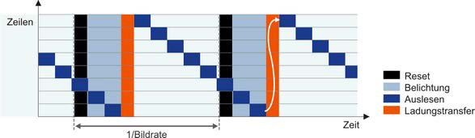
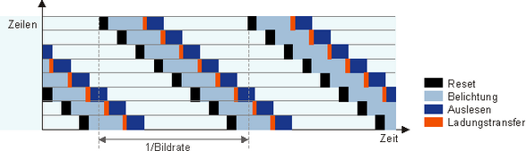

# Übung 5: Global- und Rolling-Shutter

In dieser Übung werden zwei Typen von Bildsensoren betrachtet: Sensoren mit Global- und Rolling-Shutter Auslesefunktion.
Der Unterschied während des Auslesens bezieht sich auf die zeitliche Anordnung der Belichtung der einzelnen Halbleiter
innerhalb des Sensors. Ein Halbleiter entspricht dabei einem einem Bildpunkt. Beim Global-Shutter werden alle Halbleiter
gleichzeitig belichtet. Beim Rolling-Shutter werden die einzelnen Zeilen des Sensors sequenziell belichtet.

Der Schematische Ablauf eines Global-Shutter Sensors ist in dem folgenden Bild dargestellt:

Der Schematische Ablauf eines Rolling-Shutter Sensors hingegen sieht wie folgt aus:

## Vor- und Nachteile Rolling-/Global-Shutter

Vorteile Rolling-Shutter gegenüber Global-Shutter:
 - Preisgünstiger
 - Längere Belichtungszeit möglich (weniger Rauschen) 

Nachteile Rolling-Shutter gegenüber Global-Shutter:
 - Bewegungsverzerrung

## a) Bewegungsverzerrung
In dieser Aufgabe soll die Bewegungsverzerrung eines Rolling-Shutter Sensors künstlich erzeugt werden. In dem Skript
[a.py](a.py) werden drei Bilder aus dem [KITTI](http://www.cvlibs.net/datasets/kitti/) aus einem fahrenden Auto geladen.

Ihre Aufgabe ist die Simulation eines Rolling-Shutter Sensors, indem Sie ein resultierendes  Bild aus den drei 
Zeitpunkten des Videos konstruieren. Konstruieren Sie ein Bild, indem Sie die Zeile 1, 4, 7 ... aus dem ersten Bild,
Zeile 2, 5, 8 ... sowie die Zeilen 3, 6, 9, ... aus dem dritten Bild verwenden. Visualisieren Sie das Bild.

. Die Lösung ist in der Datei [l_a.py](l_a.py) zu finden!