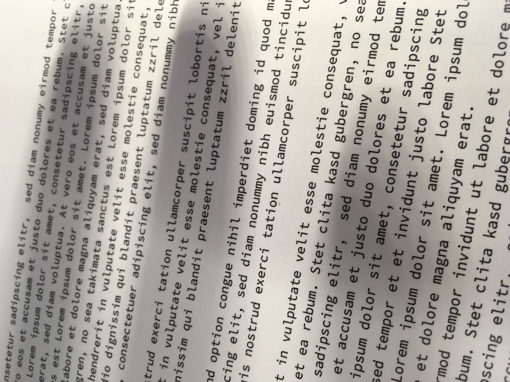

# Übung 1:  Helligkeitsausgleich

In dieser Übung wird ein Helligkeitsausgleich durchgeführt. Gegeben sind drei Bilder von Texten wie exemplarisch unten
dargestellt. Zu sehen ist, dass die mittlere Beleuchtung des Bildes lokal stark variiert. Auf Algorithmen, die beispielweise
Schwellwerte auf Gurndlage der Helligkeit nutzen, können diese Unterschiede störend wirken. Im folgenden soll daher ein
Helligkeitsausgleich durchgeführt werden, nachdem die mittlere lokale Helligkeit in jedem Bildsegment gleich ist.

## Aufgabe a)
In der Datei *a.py* werden drei Bilder geladen. Führen Sie den Helligkeitsausgleich auf allen Bildern durch und zeigen
Sie sie an.

