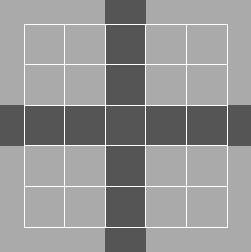
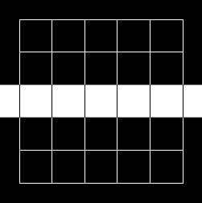

# Übung 2:  Lokale Bildoperationen

Lokale Bildoperationen berechnen den Pixelwert des Ausgangspixels aus der lokalen Umgebung des Eingangspixels. Die 
Berechnungsvorschrift ist dabei für jedes Pixel gleich.

In dieser Übung werden einige Beispiele für lokale Bildoperationen behandelt. Dabei werden unter anderem
  - Faltung
  - Gradienten 
  - Rangfolgefilter
  - Hochpass, Tiefpass, Bandpass
verwendet.

## Aufgabe a)
Das Bild zeigt ***I_in*** zwei sich schneidende Linien { eine horizontalen und eine vertikale { auf hellem
Hintergrund (außerhalb des eingezeichneten Rasters sind die Flachen wie angedeutet storungsfrei
fortgefuhrt). Es soll nun die Horizontale extrahiert und in binarer Form dargestellt werden, so dass
sich das Binärbild ***I_out*** ergibt. Im folgenden sind 
die Bilder visualisiert und als Matrix dargestellt. 


 
```python
 I_in = [
    [200, 200, 100, 200, 200],
    [200, 200, 100, 200, 200],
    [100, 100, 100, 100, 100],
    [200, 200, 100, 200, 200],
    [200, 200, 100, 200, 200],
 ]
```


```python
 I_out = [
    [  0,   0,   0,   0,   0],
    [  0,   0,   0,   0,   0],
    [255, 255, 255, 255, 255],
    [  0,   0,   0,   0,   0],
    [  0,   0,   0,   0,   0],
 ]
```

Für die Aufgabe stehen die folgenden Operationen zur Verfügung:

 - Hochpassfilter mit 3x3 Faltungskern
   
    ```python
    [
       [ -1,  -1,  -1 ],
       [ -1,   8,  -1 ],
       [ -1,  -1,  -1 ]
    ]
    ```
 - Kantenfilter mit 3x3 Faltungskern
   
    ```python
    [
       [  1,  0,  -1 ],
       [  1,  0,  -1 ],
       [  1,  0,  -1 ]
    ]
    ```
 - Kantenfilter mit 3x3 Faltungskern
   
    ```python
    [
       [  -1,  -1,  -1 ],
       [   0,   0,   0 ],
       [   1,   1,   1 ]
    ]
    ```
 - Punktoperation: Betragsbildung
 - Punktoperation: Schwellwertoperation, Punkte mit einer Intensität *I_xy* < 128 werden auf *I_xy* = 0 gesetzt, ansonsten zu 255
 - Median-Filter der Größe 3x3
    
Wählen Sie 4 der 6 Operationen und wenden Sie sie auf die das Bild an. Jede Operation darf dabei nur einmal verwendet werden.
Visualisieren Sie jeden Zwischenschritt.
Die Aufgabe soll in der Datei *a.py* bearbeitet werden! Die entsprechende Lösung finden Sie in *l_a.py*.

**Hinweis:** Mehrere Lösungswege sind möglich! 


## Aufgabe b)
Gegeben ist das Bild *edge_01.png*. Es zeigt zwei aneinander grenzende graue Flächen die mit Rauschen
versetzt sind. Ziel ist es, das Bild so zu filtern, dass die Kante als weichgezeichnete Linie auf
schwarzem Untergrund resultiert, wie in Bild *edge_02.png* beispielhaft dargestellt ist.

*edge_01.png*:  


*edge_02.png*:  
 

Für die Bearbeitung können Sie sich verschiedener Filter bedienen. Beispiele dafür können sein
 - Hochpass, Tiefpass, Bandpass
 - Diverse Richtungsfilter
 - Rangfolgefilter wie Minimum, Maximum, Median

Die Aufgabe soll in der Datei *b.py* bearbeitet werden! Die entsprechende Lösung finden Sie in *l_b.py*
