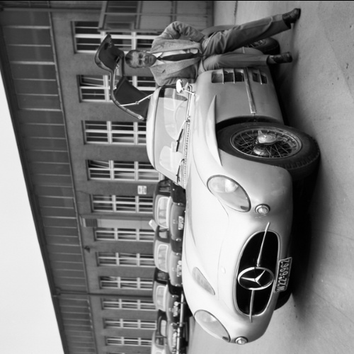

# Übung 8: Geometrische Transformation

In dieser Übung soll die Transformationsforschrift 

für die Transformation des Bildes I1 zu I2 hergeleitet werden.

| I1 | I2 |
| --- | --- |
|  |  |

Leiten Sie die Transformationsvorschrift her und testen Sie die Vorschrift, indem Sie ein Skript in die Datei [a.py](a.py)
programmieren. Die Lösung ist in der Datei [l_a.py](l_a.py) zu finden!

