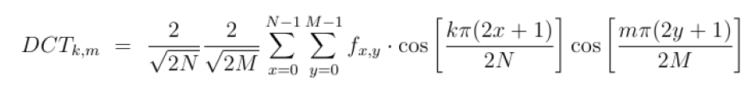

# Übung 1: Bildkompression

In dieser Übung wird der Informationsgehalt eines Bildes reduziert und die Auswirkung auf die Interpretierbarkeit 
für den Menschen betrachtet. Die Reduzierung der Informationen kann für eine Komprimierung verwendet.

Wenden Sie die folgenden Aufgaben auf die Bilder **data/yellowlilly.jpg** und **data/cameraman.png** an. 

## Aufgabe a) Entfernen hochfrequenter Frequenzen
Implementieren sie die Funktion und *remove_dft(img, rate)*, wobei mit der 
diskreten Kosinus- bzw. Fouriertransformation folgende Schritte durchgeführt werden sollen:

- Iterieren Sie Blockweise über das Bild mithilfe zweier for-Schleifen und einer Blockgröße von 8x8 Pixel
- Verwenden Sie `np.fft.fft2()` um den Block in den Frequenzraum zu transformieren
- Entfernen Sie die *n* hochfrequentesten Koefizienten mit `n = 8 * 8 * rate`
- Transformieren Sie den Block zurück in den Ortsraum mit `np.fft.ifft2` 

Wie stark wirkt sich der Parameter `rate` auf die Interpretierbarkeit des Bildes für den Menschen aus?

Die Lösung ist in der Date [l_a.py](l_a.py) zu finden.

## Aufgabe b) Diskrete Kosinus Transformation
Implementieren Sie eine Funktion `dct(a: np.ndarray)`, welche als input eine zweidimensionale Matrix erhält und 
auf diese die 2D Diskrete Kosinus Transformation nach 

anwendet und ausgibt. 

Validieren Sie Ihre Funktion, indem Sie die `fft2()` und `ifft2()` Funktion aus Aufgabe a) durch die `dct()` und `idct()` Funktionen ersetzen.
Die inverse der Transformation ist mit der Funktion `idct(a: np.ndarray)` gegeben, welche bereits in *l_b.py* implementiert ist.

 

## Aufgabe c) Fragen
- Wie kann die Reduzierung der Fourier-Koeffizienten für eine Komprimierung genutzt werden?
- Was versteht man unter diskreter Kosinustransformation und was ist der wesentliche Unterschied zur DFT?
- Welchen Vorteil bietet die DCT gegenüber der FFT in der Praxis?

