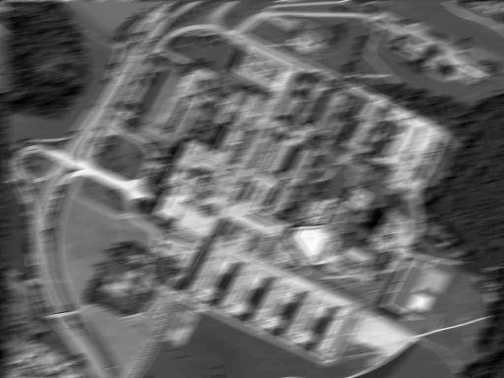

# Übung 2: Bildrekonstruktion mit Wiener Filter & Inverser Filterung 
Gegeben ist eine Abbildung der ETH-Zürich mit einer Bildstörung wie im folgenden zu sehen:

Als Bildstörung ist hier Motion Blur einer gleichförmigen Kamerabewegung von 31 Pixel
und einem Winkel von 11 Grad (gegen den Uhrzeigersinn) verwendet.
Berechnen 

# Aufgabe a) Inverse Filterung
Benutzen Sie inverse Filterung um die Bildstörung (Motion Blur und Rauschen) im Bild
zu entfernen. Die Inverse Filterung muss anhand der Formeln von der Vorlesung selbst programmiert werden.

Verwenden Sie eine geeignete "cutoff"-Frequenz.
Nutzen Sie die Datei [a.py](a.py) um Ihre Lösung zu implementieren. In der Datei ist die "Point Spread Function" (PSF)
bereits implementiert und in den Frequenzbereich transformiert. Die PSF entspricht der Transferfuntkion der
Bildstörung.

# Aufgabe b) Wiener Filterung
Nutzen Sie ebenfalls Datei [a.py](a.py),
Benutzen Sie Wiener Filterung um die Bildstörung (Motion Blur und Rauschen) im Bild
zu entfernen. Die Wiener Filterung muss anhand der Formeln von der Vorlesung selbst programmiert werden.

Verwenden Sie einen geeigneten Parameter K für den Wiener Filter.