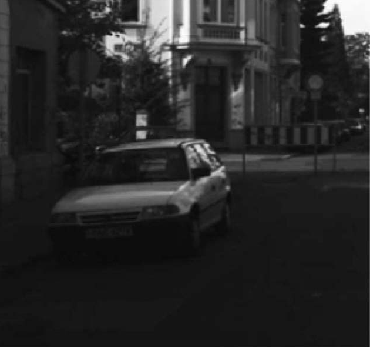

# Übung 5: Homomorphe Filterung

In dem Skript [a.py](a.py) wird das Bild *I*

 

geladen. Das Bild zeigt eine schlecht belichtete Szene, in der Details nicht
gut zu erkennen sind. In dieser Übung soll der Kontrast verbessert werden, damit
mehr Details erkennbar sind.

## Aufgabe a)

Wenden Sie die Homomorphe Filterung auf das Bild *I* an, indem Sie folgende Schritte implementieren:

1. Logarithmieren Sie die Werte in Grauwerte in *I*
2. Transformieren Sie *I* in den Frequenzbereich
3. Unterdrücken Sie niedrige Frequenzen durch die Funktion H(k,l)

5. Transformieren Sie *I* zurück in den Bildbereich
6. Kehren Sie die Logarithmierung aus Schritt 1. durch die Exponentialfunktion um

Der erste Teil der Aufgabe ist in der Datei [a.py](a.py) zu finden.

Sie finden die Musterlösung in der Datei [l_a.py](l_a.py).

**Hinweis:** Arbeiten Sie mit einem Wertebereich zwischen 0 und 1!
