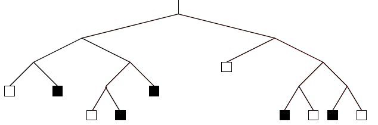
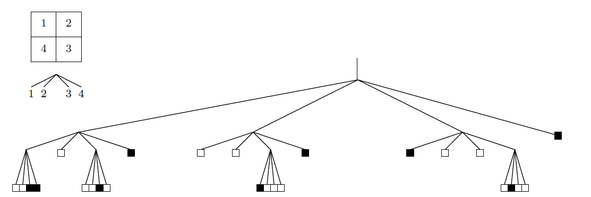

# Übung 3: Binärbild Repräsentationen 

In dieser Übung werden Darstellungsformen von Binärbildern betrachtet. Sie lernen Binär und Quaternärbäume kennen. 

## Aufgabe a) Binärbaum
Gegeben ist folgender Binärbaum:

Rekonstruieren Sie die Bildzeile, die durch den Binärbaum dargestellt wird. 
Sie können die Aufgabe mit Papier und Stift erledigen. Die Lösung wird in dem Skript **l3a.py** visualisiert.

## Aufgabe b) Quaternärbaum
Gegeben ist folgender Quaternärbaum (Quadtree) mit einer Zuordnung der vier Quadranten:

Rekonstruieren Sie das Binärbild, die durch den Quaternärbaum dargestellt wird. 
Sie können die Aufgabe mit Papier und Stift erledigen. Die Lösung wird in dem Skript **l3b.py** visualisiert.

