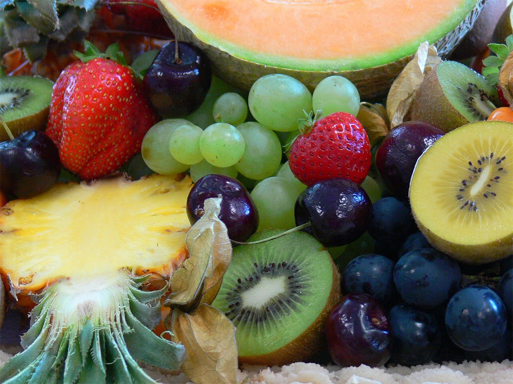

# Übung 4: Weißabgleich

Bei Digitalaufnahmen lässt sich über Bildverarbeitungssoftware der Weißabgleich zu einem gewissen
Grad per Software korrigieren. Dazu skaliert man die relativen Luminanzen der Kanäle Rot,
Grün und Blau. Die Skalierung wird über eine Multiplikation mit der folgenden Diagonalmatrix
realisiert.

Das Problem ist nun die Parameter für den optimalen Weißpunkt zu wählen.

## Aufgabe a)

Laden Sie das Bild [../../data/obst.png](../../data/obst.png) und geben Sie er aus. Führen Sie danach den Weißabgleich durch.
Wählen Sie als Parameter Werte, sodass die Farbwerte des Pixels an Stelle x=127 y=146 den Farbwert (255, 255, 255) haben.
Zeigen Sie ebenfalls das abgeglichene Bild an. Die Musterlösung findet sich in der Datei [l_a.py](l_a.py).

## Aufgabe b)

Führen Sie den Weißabgleich auf Ihrem Webcam-Stream durch. Sie können die Parameter frei wählen und variieren.
Die Musterlösung findet sich in der Datei [l_b.py](l_b.py).