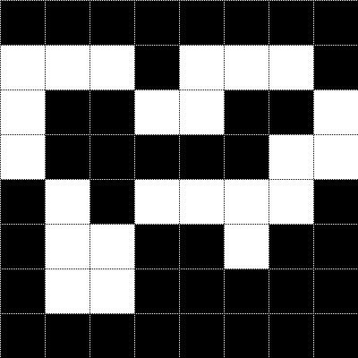

# Übung 4: Kettencode

Eine Variante für die Abbildung von Konturen is der Kettencode. Im folgenden sollten Bilder in den Kettencode codiert und
Kettencodes in Konturen decodiert werden.

Für die Codierung mit dem Kettencode soll folgende Zuordnung verwendet werden:
<p align="center">

</p>


Für die Codierung mit dem differentiellen Kettencode soll folgende Zuordnung verwendet werden:
<p align="center">

</p>


## Aufgabe a) Kettencode

Erstellen Sie für das Bild 



einen Kettencode! Beginnen Sie mit dem Pixel oben links und dem Wert 0. 

## Aufgabe b) Kettencode

Erstellen Sie das Bild für den Kettencode

```[6 4 6 3 4 5 6 4 2 2 3 2 2 0 0 7 0 2 0 0 7 6]```


## Aufgabe c) Differentieller Kettencode

Erstellen Sie für das Bild aus Aufgabe a)
einen differenziellen Kettencode! Beginnen Sie mit dem Pixel oben links und dem Wert 0. 

## Aufgabe d) Differentieller Kettencode

Erstellen Sie das Bild für den differentiellen Kettencode

```[-2 -2 2 -3 1 1 1 -2 -2 0 1 -1 0 -2 0 -1 1 2 -2 0 -1 -1]```
