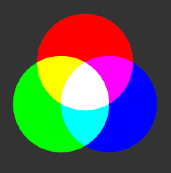
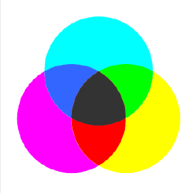

# Übung 6: Additive / Subtraktive Farbmischung

In dieser Übung soll die Additive und Subtraktive Farbmischung betrachtet werden.
Es soll ein simples Bild mit der Auflösung 500x300 (BxH) erstellt und angezeigt werden, in der jeweils 
von oben aufsteigend jeweils 50 Pixel in der Farbe
 - rot
 - orange
 - gelb
 - grün
 - blau 
 - lila
 
In dieser Übung haben Sie die beiden Farbrepräsentationen "Additiv BGR" und "Subtraktiv BGR" zur Verfügung.
In der folgenden Tabelle sind beide Repräsentationen dargestellt:

| Additiv | Subtraktiv |
| --- | --- |
| | |

## Aufgabe a)

In der Datei [a.py](a.py) ist ein leeres Bild vordefiniert. Ergänzen Sie die Farben, um das Bild zu vervollständigen.
In dieser Aufgabe wird eine Farbe im additiven BGR Farbraum dargestellt. Die Musterlösung findet sich in der Datei [l_a.py](l_a.py).

## Aufgabe b)

In der Datei [b.py](b.py) ist ein leeres Bild vordefiniert. Ergänzen Sie die Farben, um das Bild zu vervollständigen.
In dieser Aufgabe wird eine Farbe im subtraktiven BGR Farbraum dargestellt. Die Musterlösung findet sich in der Datei [l_b.py](l_b.py).

