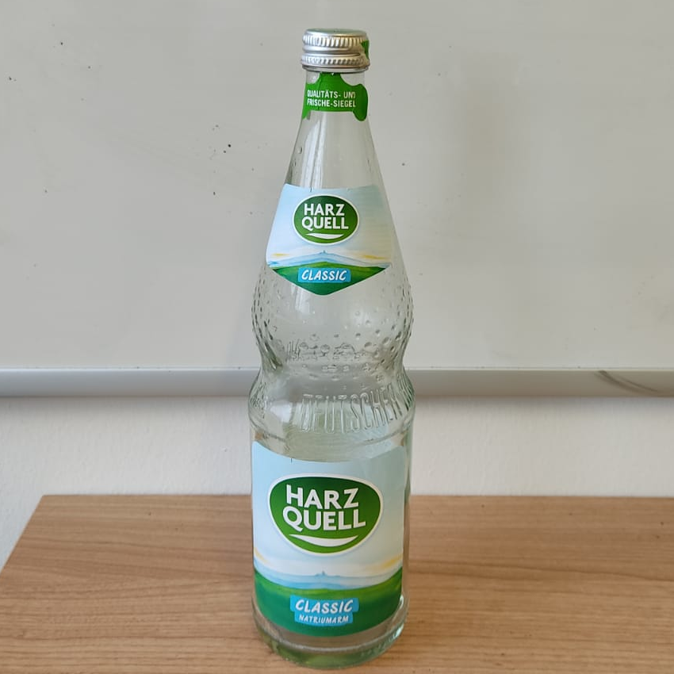
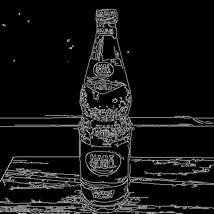
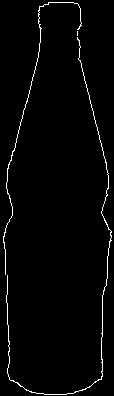

# Übung 10: Objekt Detektion

Sie haben folgendes Bild gegeben, in dem Sie eine Flasche detektieren wollen:

Weiterhin haben Sie bereits ein Kantenbild und ein Template erhalten:

| Kantenbild | Template |
| ---------- | -------- |
|  |  |

## a) Template Matching

Sie sollen ein Template Matching durchführen, um die Position zu finden, 
an welcher eine Flasche mit der größten Wahrscheinlichkeit steht. Nutzen Sie dafür das gegebene Template einer Flasche. 
Um die Aufgabe zu lösen, implementieren Sie die folgenden Schritte:

 1. Laden Sie das Template und das Kantenbild
 2. Legen Sie das Template auf jeden möglichen Bildausschnitts des Kantenbildes und erstellen Sie einen Matching-Score.
    1. Schneiden Sie einen Bildausschnitt in der Größe des Templates aus
    2. Berechnen Sie Fläche des Querschnitt des Templates und des Bildausschnitts. Dies ist der Matching-Score dieser Position.
    3. Speichern Sie den Matching Score für die Position
 3. Finden Sie die Position mit dem größten Matching-Score und visualisieren Sie ihn in dem originalen Bild.
 
**Hinweise:**
 - In dieser Übung sollen nur Bildausschnitte betrachtet werden, auf die das gesamte Template passt
 - Das Template soll **NICHT** skaliert werden (Größen-Variant)

Bitte führen Sie für die Bearbeitung der Aufgabe das Skript [a.py](a.py) fort. 
Die Lösung befindet sich in Datei [l_a.py](l_a.py).
