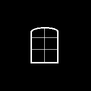
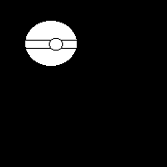
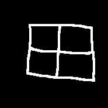
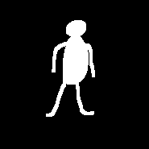

# Übung 11: Objekt Klassifikation

In dieser Aufgabe sollen Sie einen Algorithmus für die Klassifikation von bereits segmentierten Objekten schreiben.
Dabei sollen Sie jedem der 6 folgenden Bilder eine Klasse zuordnen. Die Möglichen Klassen sind dabei 

- Mensch
- Ball
- Fenster

|  |  |  |
| ---------- | -------- | ----- |
|  |  |  |

## a) Erzeugung von Merkmalen

Erstellen Sie enige Merkmale, welche Größe oder Form der Objekte quantitativ beschreiben. Achten Sie darauf,
dass die Merkmale möglichst diskriminativ sind, sodass sie zur Unterscheidung in die verschiedenen Klassen genutzt 
werden können.

Bitte führen Sie für die Bearbeitung der Aufgabe das Skript [a.py](a.py) fort. 
Die Lösung befindet sich in Datei [l_a.py](l_a.py).

## b) Klassifikation von Merkmalen
Erstellen Sie nun qualitative Regeln mit den in Aufgabe a) erstellen Merkmalen, um die Elemente in den Bildern zu 
klassifizieren. Sie brauchen dabei nicht programmieren, sondern lediglich Regeln für die Klassifizierung erstellen. 

Eine mögliche Lösung befindet sich in Datei [l_b.md](l_b.md).
