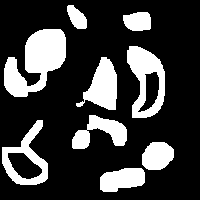
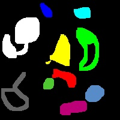
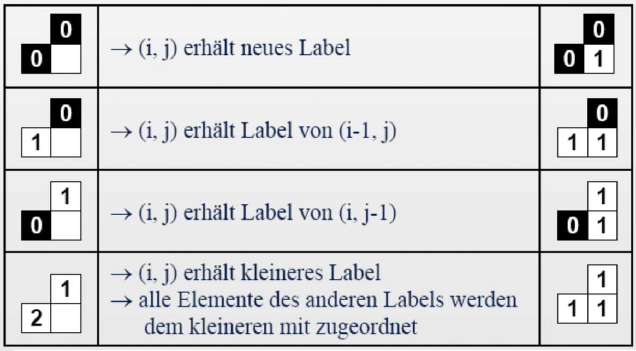
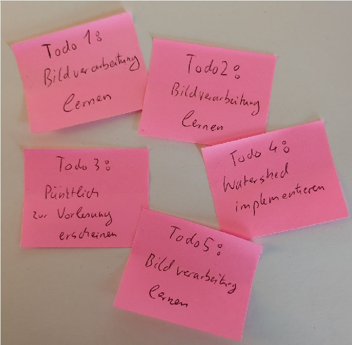
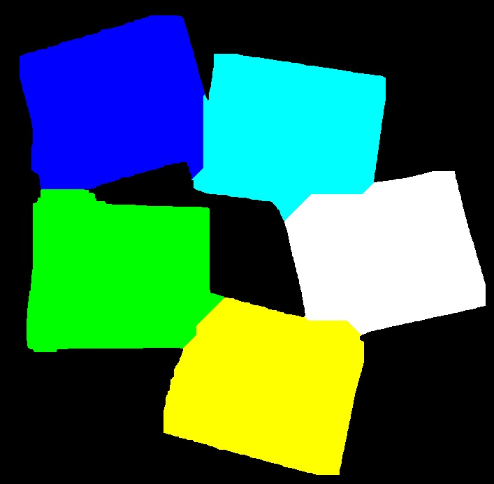

# Übung 13: Instanzsegmentierung 

In dieser Aufgabe sollen verschiedene Instanzen von Objekten in einem binär segmentierten Bild gefunden werden.

## a) Zeilenkoinzidenzverfahren

Betrachten Sie das folgende Bild und die dazugehörige Instanzsegmentierung:

| Binärbild | Instanz-segmentiertes Bild |
| --- | --- |
|  | |

Finden Sie in dem Binärbild zusammenhängende bzw. getrennte Objekte nach dem Zeilenkoinzidenzverfahren nach der foldengen
Anleitung:

Geben Sie dabei jedem neuen Objekt eine eigene ID und visualisieren Sie das Ergebnis.

Bitte führen Sie für die Bearbeitung der Aufgabe das Skript [a.py](a.py) fort. 
Eine Lösung befindet sich in Datei [l_a.py](l_a.py).

## b) Watershed Algorithmus

Betrachten Sie das folgende Bild und die dazugehörige Instanzsegmentierung:

| Binärbild | Instanz-segmentiertes Bild |
| --- | --- |
|  | |

Führen Sie nun die Instanzsegmentierung mit der folgenden
Anleitung selbst durch:

- Binarisieren Sie das Bild, sodass der Hintergrund das Label 0 und die Sticker das Label 1 haben
- Füllen Sie im Binärbild kleine Löcher und entfernen Sie kleine Regionen (Rauschen)
- Erstellen Sie Seed-Punkte/Regionen, indem Sie das Binärbild stark erodieren und das Zeilenkoinzidenzverfahren (siehe oben) anwenden
- "Füllen" Sie iterativ die Pixel mit dem Label 1 zu den Seedpunkten hinzu 

Geben Sie am Ende jedem Objekt eine eigene ID und visualisieren Sie das Ergebnis.

Bitte führen Sie für die Bearbeitung der Aufgabe das Skript [b.py](b.py) fort. 
Eine Lösung befindet sich in Datei [l_b.py](l_b.py).
