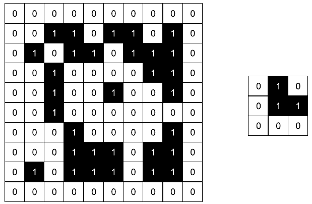

# Übung 2: Morphologische Operatoren

In dieser Übung werden die morphologischen Operatoren *Dilatation* und *Erosion* behandelt. 

## Aufgabe a)
Geben Sie die Definition der Dilatation und der Erosion an! Die Lösung findet sich in [l_a.md](l_a.md).

## Aufgabe b)
Geben Sie die Definition von *Opening* und *Closing* als Funktion von Dilatation und der Erosion an! Die Lösung findet sich in [l_b.md](l_b.md).

## Aufgabe c) 
Wenn ein Binärbild nach einer Erosion an einer Position (x, y) den Wert 1 hat, muss dann
das ursprüngliche Bild ebenfalls an der Stelle (x, y) den Wert 1 haben?  Die Lösung findet sich in [l_c.md](l_c.md).

## Aufgabe d)
Gegeben seien folgendes Binärbild (links) und Strukturelement (rechts, Ursprung in der Mitte).
Berechnen Sie das Ergebnisbild nach dem Ausführen einer Opening-Operation.

Das Binärbild finden Sie in der Datei [d.py](d.py). Die dazugehörige Musterlösung in der Datei [l_d.py](l_d.py).
