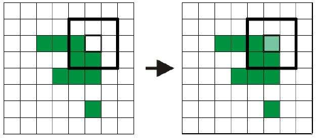
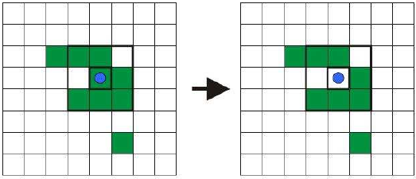

# Musterlösung Aufgabe a)

Die beiden Basisoperatoren in der morphologischen Filterung sind die dualen Filter Erosion
(Verkleinerung, Ausdünnung) und Dilatation (Vergrößerung, Aufblähung).

Bei einer Dilatation (lat: dilaterare: ausbreiten, dehnen) werden Hintergrundpixel, die bestimmte
Voraussetzungen erfüllen, in den Vordergrund aufgenommen. Eine bestimmte Pixelposition (Ankerpunkt)
wird auf 1 gesetzt (also dem Vordergrund zugeordnet), falls das Strukturelement mindestens
ein Pixel mit Wert 1 des Bildes überdeckt.

Die der Dilatation entgegengesetzte Operation nennt man Erosion (lat: erodere = abnagen). Diese
Operation verkleinert die Segmente, indem bestimmte Segmentpixel dem Hintergrund beigeordnet
werden. Hier wird der Ankerpunkt auf 0 gesetzt (also dem Hintergrund zugeordnet), falls das
Strukturelement mindestens ein Pixel des Binärbildes mit den Wert 0 überdeckt. Andernfalls wird
der Ankerpunkt auf 1 gesetzt.

