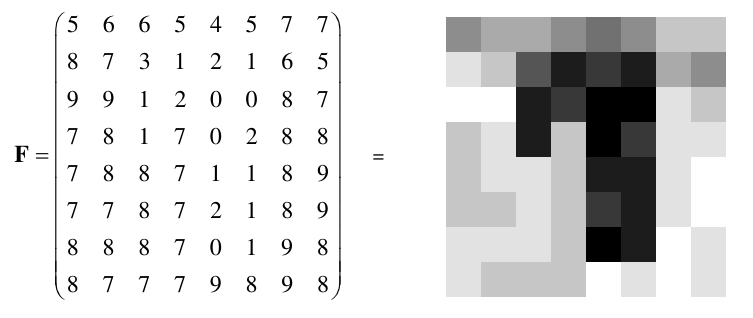

# Übung 3: Split and Merge

Sie haben folgendes Grauwertbild gegeben:

Dabei gilt die Homogenitätsbedingung:

## Aufgabe a: 
Wenden Sie den "Split and Merge" Algorithmus auf **F** an.

## Aufgabe b:
Zerlegen Sie das Bild in eine Quad-Tree Sruktur.

## Aufgabe c)
Zeichnen Sie das Segmentierungsergebnis.

## Aufgabe d)
Ist das Ergebnis eindeutig?
