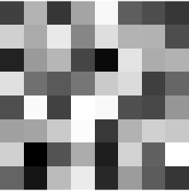

# Übung 4: Region Growing
Gegeben ist der folgende Bildausschnitt:

  

## Aufgabe a)
Wenden Sie auf diesen Bildausschnitt das Region Growing Verfahren sowohl für die 4-
Nachbarschaft als auch für die 8-Nachbarschaft an. Der Seed-Punkt ist in der ersten Reihe, Spalte 5. Verwenden Sie als Homogenitätskriterium den Abstand zum mittleren Grauwert
der Region und als Schwellwert 30.
