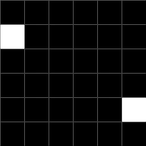

# Übung 7: Distanzmetriken

Betrachten Sie das folgende Binärbild:

Es soll der Abstand zwischen dem obersten Pixel an der Position (0,1) und dem 
Pixel an der Stelle (5, 4) berechnet werden.

## a) 

Berechnen Sie 
 - die City-Block Distanz
 - den euklidischen Abstand
 - die Schachbrett Distanz (Tschebyschew-Abstand).

Die Lösung befindet sich in Datei [l_a.py](l_a.py).
