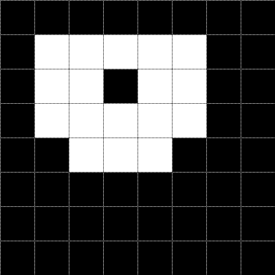
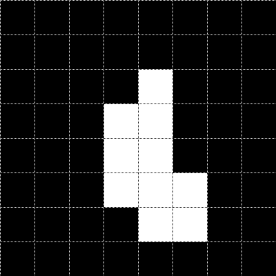

# Übung 8: Vereinigung und Querschnitt

Betrachten Sie die folgenden Binärbilder:

| Objekt 1 | Objekt 2 |
| -------- | -------- |
|  |  |

## a) Vereinigung

Zeichnen Sie die Vereinigung der beiden Objekte.
Die Lösung befindet sich in Datei [l_a.py](l_a.py).
