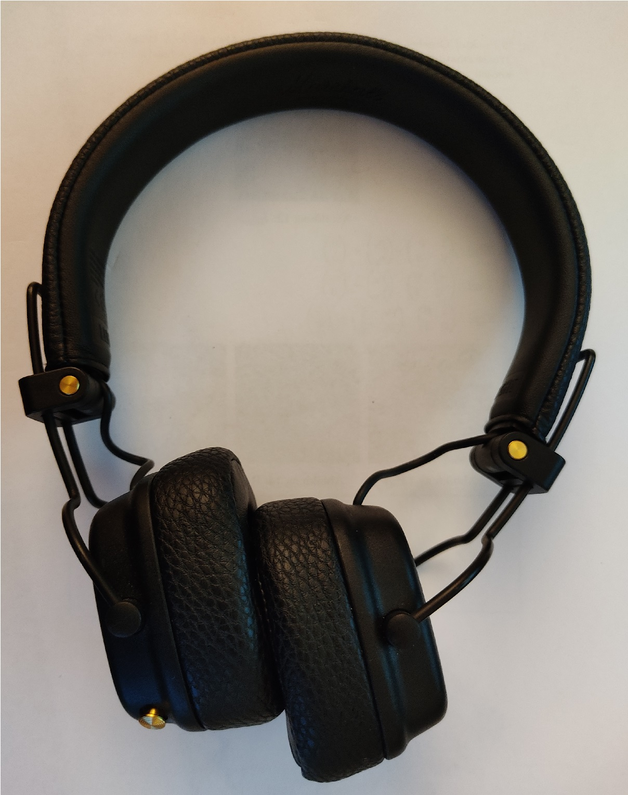

# Übung 9: Kantendetektion

Sie möchten die Kanten des Kopfhörers in dem folgenden Bild detektieren:
 

## a) Morphologische Operationen

Finden Sie die Kanten, indem Sie das Bild zuerst mit einem geeigneten Schwellwert binarisieren. Verwenden Sie
dann einer der beiden morphologischen Operationen Dilatation oder Erodieren. Wenden Sie dann auf das
Binärbild und morphologisch modifizierte Binärbild eine Subtraktion an und visualisieren Sie die so gefundenen
Kanten in dem originalen Bild.

Die Lösung befindet sich in Datei [l_a.py](l_a.py).
