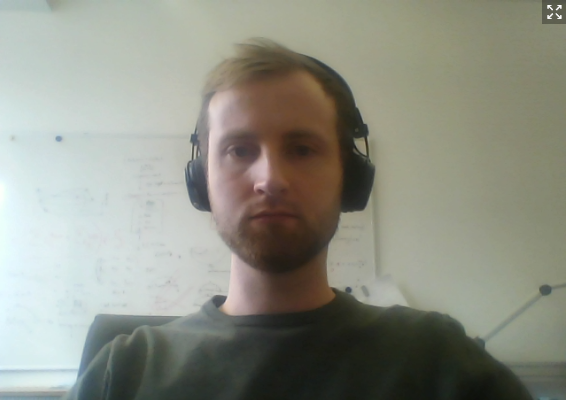
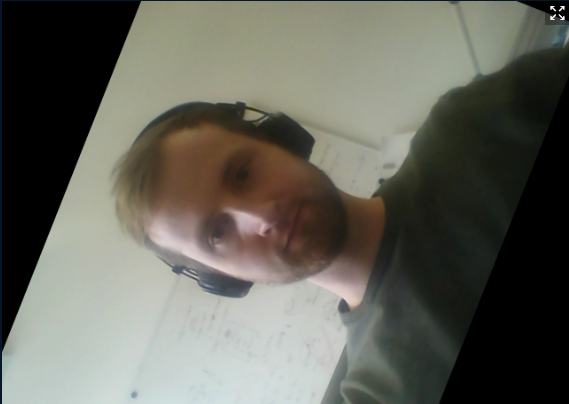

# CV-Application
Original             | Geom. Transformation | Chrominanz
:-------------------------:|:-------------------------:|:-------------------------:
  |   | 

Die CV-App ist eine Applikation, mit der eine Bildverarbeitungs-Pipeline generiert werden kann. Die Pipeline ließt eine 
vorhandene Webcam aus. Der Inhalt dieses Videostreams wird dann durch CV-Algorithmen be- und/oder verarbeitet und angezeigt.
Optional kann der so erzeugte Videostream an eine virtuelle Kamera weitergeleitet werden. Diese virtuelle Kamera kann 
dann von anderen Programmen (z.B. für Videokonferenzen) wie eine normale Webcam ausgelesen werden.

Zwei einfache Algorithmen wie die geometrische Transformation oder die Entfernung der Luminanz sind in oberen 
Abbildungen dargestellt.


## Anleitung
### Treiber virtuelle Kamera
Die Grundfunktion der CV-App ist einsatzbereit, sobald dieses Repository erfolgreich installiert ist. Sie können Ihre
Webcam einlesen und CV-Algorithmen auf den Videostream anwenden. 
Für die Nutzung der virtuellen Kamera ist ein  zusätzlicher Treiber notwendig. Je nachdem welches Betriebssystem Sie 
nutzen, kann dieser variieren. Die nötige Treiber Installation finden Sie unter
 [https://github.com/letmaik/pyvirtualcam](https://github.com/letmaik/pyvirtualcam).

### Bedienung des Programms
Führen Sie das Skript `main.py` aus diesem Verzeichnis mit dem Befehl

```bash
python main.py --camera=0 --mode=virtual_cam --video=PFAD_ZU_EINEM_VIDEO
```

im Terminal aus. Dabei stehen Ihnen einige optionale Parameter zur Verfügung. Wenn Sie die Parameter nicht angeben,
werden die Default-Werte verwendet. Die Bedeutung der Parameter sowie die Default-Werte finden Sie in der folgenden 
Tabelle.

**Parameter** | **Default-Wert** | **Beschreibung**
:---:|:---:|:---:|
--camera| 0 | OpenCV ID der Kamera. Wenn -1 angegeben ist, wird anstelle einer Kamera ein Video in Dauserschleife gespielt. 
--mode| *virtual_cam* | Entweder *virtual_cam* (mit virtueller Kamera und Bildschirmausgabe) oder *screen* (nur Bildschirmausgabe)
--video | - | Gibt den Pfad zum Video an, wenn --camera=-1 ist

**Hinweise:** 
- Sollten Sie keine Kamera zur Verfügung haben, können Sie *--camera=-1* wählen, um ein Video zu verwenden
- Die Default-Werte sind in `main.py` definiert und können dort angepasst werden

Nachdem Sie das Programm erfolgreich gestartet haben, sollten Sie das Bild der Kamera in einem neu geöffneten Fenster
sehen. Zu Beginn der Programmausführung wird kein CV-Algorithmus auf das Bild angewendet (Eingangsbild=Ausgangsbild). 
Sie können verschiedene Funktionen bzw. Algorithmen durch betätigen verschiedener Tasten aktivieren. Als Standard sind 
einige Funktionen auf den Tasten *1* bis *10* vorprogrammiert. Es ist ebenfalls möglich, mit Maus-Aktionen mit der
Pipeline zu interagieren. 

Mit den Tasten **f** und **e** können Sie den Auto**f**okus bzw. Auto**e**xposure aktivieren oder deaktivieren.

**Hinweise:**
- Sie können nur mit der App interagieren, wenn das Programmfenster im Vordergrund ist! 
- Autofokus und Autoexposure sind für viele Webcams nicht supported!

## Eigene CV Algorithmen
Für die Implementierung eigener Algorithmen sind nur Dateien in dem Unterverzeichnis *algorithms* notwendig. Öffnen 
Sie sich in das Verzeichnis und lesen die folgenden Abschnitte. Nachdem Sie die Abschnitte gelesen haben können Sie die Übungsaufgabe
in der Datei [exercise.md](./exercise.md) bearbeiten. 
 
### Eigenen "Algorithm" erstellen
Sie können einen eigenen Algorithmus erstellen, in dem Sie ein neues Skript in dem Ordner *algorithms* erstellen. Das 
folgende Skript *algorithms/your_algorithm.py* zeigt einen beispielhaften Algorithmus, der einen Weißabgleich implementiert.

```python
import cv2
import numpy as np

from . import Algorithm


class YourAlgorithm(Algorithm):
    """ The implementation of your algorithm """

    def __init__(self):
        """ Inititation of your algorithm. You can store member variables here! """
        self.max_b, self.max_g, self.max_r = 255, 255, 255
        self.last_image = None

    def process(self, img):
        """ Here the input image (img) is processed and returned """
        self.last_image = img
        img = img.astype(np.float32)
        img[:, :, 0] = np.clip(img[:, :, 0], 0, self.max_b) * 255 / max(1, self.max_b)
        img[:, :, 1] = np.clip(img[:, :, 1], 0, self.max_g) * 255 / max(1, self.max_g)
        img[:, :, 2] = np.clip(img[:, :, 2], 0, self.max_r) * 255 / max(1, self.max_r)
        img = img.astype(np.uint8)
        return img

    def mouse_callback(self, event, x, y, flags, param):
        """ The mouse callback react on mouse events """
        if self.last_image is None:
            return
        if event == cv2.EVENT_LBUTTONUP:
            self.max_b, self.max_g, self.max_r = \
                self.last_image[y, x, 0], self.last_image[y, x, 1], self.last_image[y, x, 2]
```

Die Funktion *\_\_init\_\_(self)* wird bei der Erstellung des Algorithmus aufgerufen. Sie können dort Variablen definieren,
die während der gesamten Laufzeit gespeichert bleiben. So können Sie z.B. Daten zwischen der Eingabe mehrerer Bilder 
speichern.
Die Funktion *process.py(self, img)* verarbeitet jedes ausgelesene Bild. Am Ende der Funktion **muss** ein Bild mit selber Höhe und 
Breite ausgegben werden.
Die Funktion *mouse_callback(self, event, x, y, flags, param)* wird bei Maus-Events ausgeführt. Für weitere Information 
lesen Sie z.B. [hier](https://techtutorialsx.com/2020/12/08/python-opencv-mouse-events/).

In dem Ordner *algorithms* sind mehrere Beispiele für Algorithmen gegeben.

### Verlinken des eigenen Algorithmus zu einer Taste
Ihr Algorithmus *YourAlgorithm* kann nun zu einer Taste verlinkt werden. Der folgende Code entspricht in etwa dem Inhalt
der Datei *\_\_init\_\_.py*. Ihr Algorithmus ist in dem Beispiel an die Taste *3* verlinkt. Um weitere Algorithmen zu 
verlinken müssen Sie lediglich einen weiteren Import und einen Eintrag in das algorithmus-dictionary hinzufügen.

```python
class Algorithm:

    def process(self, img):
        return img

    def mouse_callback(self, event, x, y, flags, param):
        return

from .image_to_gray import ImageToGray
from .image_to_hue import ImageToHue
from .your_algorithm import YourAlgorithm

algorithms = dict()
algorithms["0"] = Algorithm
algorithms["1"] = ImageToGray
algorithms["2"] = ImageToHue
algorithms["3"] = YourAlgorithm
```
 
## Anforderungen
Hardware:
 - Webcam, die von OpenCV eingelesen werden kann

Getestet mit Python Versionen:
 - 3.6
 
Getestet auf Betriebssystemen:
 - Windows 10   
 - OpenSuse (pyvirtualcam funktioniert nicht!)
    
