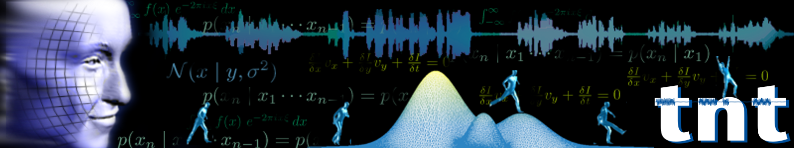

# Digitale Bildverarbeitung
[english version below]

Sehr geehrte Studierende,

dieses Github-Repository bietet Ihnen praktische Übungsmaterialien zur 
Vorlesung "Digitale Bildverarbeitung" des [Instituts für Informationsverarbeitung](https://www.tnt.uni-hannover.de/en/)
an der [Leibniz Universität Hannover](https://www.uni-hannover.de/).

Die Übungsmaterialien sollen die erlernten theoretischen Grundlagen
festigen und zusätzlich einen Einblick in die angewandte Praxis 
moderner Bildverarbeitung geben. Den Studierenden wird mit
Programmierübungen gezeigt, wie einfache, aber auch komplexe Aufgaben
mithilfe von Grundlagen der Digitalen Bildverarbeitung gelößt werden 
können. In den nächsten Abschnitten wird ein kurzer Überblick über
die Struktur und Inhalte dieses Online-Kurses gegeben.

Die Autoren dieser Übungen würden sich freuen, wenn dieses Repository
das Interesse von Studierenden an der Bildverarbeitung wecken könnte,
dass über den Erwerb von Leistungspunkten hinaus geht.

Gez. die Autoren

## Struktur
Dieses Repository ist unterteilt in die Themenbereiche
 0. Einführung
 1. Grundlagen
 2. Bildbearbeitung
 3. Signalorientierte Bildverarbeitung
 4. Farbrepäsentationen
 5. Bildanalyse
 
welche jeweils mit Übungsaufgaben, Lösungen sowie begleitendem Material
ausgestattet sind.

Zusätzlich sind die Ordnerstrukturen
 - CV-App
 - data: Daten für die Verarbeitung, z.B. Bilder
 - utilities: Allgemeine Hilfsskripte und Tools
 - Sandkasten: Ort, um eigene Dinge auszuprobieren
 
vorhanden. Die **CV-App** nimmt dabei eine besondere Position ein, da
den Studierenden hier mit einer Interaktiven Appliaktion der praktische
Nutzen von Bildverarbeitung demonstriert wird und ebenfalls Material 
für fortgeschrittene Programmierübungen gegeben wird, welche hier nicht
explizit behandelt werden.

---
Das Erlernen der Fertigkeiten wird mit zwei Aufgabentypen unterstützt: 
**Übungen** sowie **Action-Übungen**.

Eine herkömmliche **Übung** bietet den Studierenden eine zu lösende 
Aufgabe mit einem eindeutig definierten, deterministischem und 
reproduzierbarem Ergebnis. Diese Struktur soll die Verunsicherung
 in der Lernphase reduzieren, welche durch undefinierte Begriffe 
oder subjektive Anforderungen in der Bildverarbeitung entstehen können. 
**Übungen** sind mit Dateinamen wie `ü1.py` versehen.

Die in den **Action-Übungen** zu lösenden Aufgaben zeichnen sich
durch Interaktion mit dem Studierendem aus. Die Lösung ist daher
gleichzeitig von Aufgabenstellung sowie vom Studierenden abhängig.
Diese Aufgaben sollen spannende und praktische Anwendungen demonstrieren
und aufzeigen, dass die theoretische Lehre der Bildverarbeitung 
schnell und praktisch implementiert werden kann. Für die Lösung der 
Aufgaben kann eine Kamera benötigt sein.
**Action-Übungen** sind mit Dateinamen wie `a1.py` versehen.

Zu jeder Übung gibt es eine Lösungsdatei mit einer
(von möglicherweise vielen!) Musterlösung. Die Dateien sind mit der
Bennenung von z.B. `l1.py` gekennzeichnet.
---

Im folgenden werden die Themenschwerpunkte des Kurses kurz erläutert.

### 0. Einführung
Der Themenbereich **Einführung** hilft den Studierenden bei der Installation,
Einrichtung und der ersten Nutzung der Arbeitsumgebungumgebung für diesen 
Kurs. Es wird noch nicht auf den Themenkomplex Bildverarbeitung 
eingegangen. 

Das Kapitel ist für Neulinge in den folgenden Bereichen zu empfehlen:

 - Installation Python und/oder PyCharm
 - Programmierung Python
 - OpenCV und Numpy

### 1. Grundlagen

### 2. Bildbearbeitung

### 3. Signalorientierte Bildverarbeitung

### 4. Farbrepäsentationen

### 5. Bildanalyse

## FAQ, Kommentare und Hinweise
 - Dieses Repository hat keinen Anspruch auf Vollständigkeit
 - Hauptsprache der Kurses ist Deutsch
 - Er wird versucht, Texte und Erläuterungen sowohl in Deutsch als auch 
 Englisch zu bieten
 - Interessierte dürfen eigene Übungen erstellen und per Pull-Request
 in das Repository einpflegen. Vielen Dank für das Engagement!
 - Viel Spaß beim Lernen!
